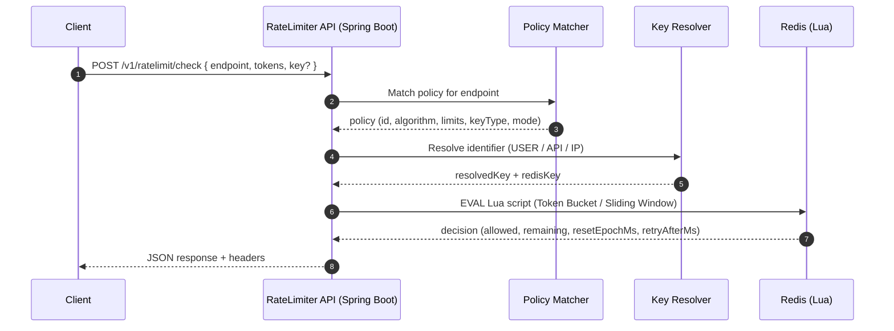
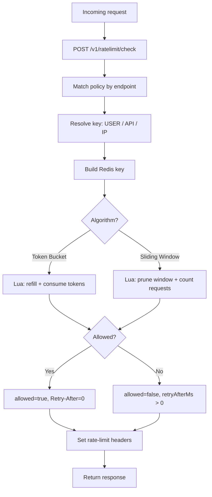

# Distributed API Rate Limiter & Protection Service


**Java • Spring Boot • Redis (Lua) • Docker • GitHub Actions • Actuator/Prometheus**

A production-style, distributed rate limiting service that enforces per-user, per-IP, and per-endpoint limits using **atomic Redis Lua scripts**. Supports **Token Bucket** and **Sliding Window Log** algorithms, configurable policies, and standard rate-limit headers.

---

## At-a-glance

- **Token Bucket** (burst-friendly)
- **Sliding Window Log** (precise window enforcement)
- **Per-user / per-IP / per-endpoint** policies
- **Fail-open / Fail-closed** behavior on Redis outages
- **Metrics** + Prometheus endpoint via Actuator

---

## Architecture

```text
Client
  |
  |  POST /v1/ratelimit/check
  v
Spring Boot API
  |
  |  atomic eval via Redis Lua scripts
  v
Redis (hash/zset)
```

### Request flow
### Sequence Diagram


### Decision Flow



---

## API

### Check a request
`POST /v1/ratelimit/check`

**Body**
```json
{
  "key": "user:123",
  "endpoint": "POST:/orders",
  "tokens": 1
}
```

**Allowed**
```json
{
  "allowed": true,
  "policyId": "perUserOrders",
  "key": "user:123",
  "endpoint": "POST:/orders",
  "limit": 20,
  "remaining": 19,
  "resetEpochMs": 1730000000000,
  "retryAfterMs": 0,
  "modeUsed": "FAIL_CLOSED"
}
```

**Blocked**
```json
{
  "allowed": false,
  "policyId": "perUserOrders",
  "key": "user:123",
  "endpoint": "POST:/orders",
  "limit": 20,
  "remaining": 0,
  "resetEpochMs": 1730000000000,
  "retryAfterMs": 1200,
  "modeUsed": "FAIL_CLOSED"
}
```

**Curl**
```bash
curl -s http://localhost:8085/v1/ratelimit/check \
  -H 'Content-Type: application/json' \
  -H 'X-User-Id: 123' \
  -d '{"endpoint":"POST:/orders","tokens":1}' | jq
```

### View policies
`GET /v1/ratelimit/policies`

---

## Configuration

Policies live in `src/main/resources/application.yml`:

```yml
ratelimiter:
  defaultMode: FAIL_CLOSED
  keyPrefix: rl
  policies:
    - id: perUserOrders
      match:
        endpoint: "POST:/orders"
      keyType: USER
      algorithm: TOKEN_BUCKET
      capacity: 20
      refillTokens: 20
      refillPeriodMs: 60000

    - id: perIpGlobal
      match:
        endpoint: "*"
      keyType: IP
      algorithm: SLIDING_WINDOW
      limit: 300
      windowMs: 60000
```

Key resolution:
- `USER` → `X-User-Id` header (or explicit `key` in request)
- `API` → `X-Api-Key` header
- `IP` → `X-Forwarded-For` (first value) or request remote address

---

## Design Decisions

- **Redis Lua scripts** ensure rate limit checks are **atomic** and safe under concurrency.
- **Token Bucket** provides burst handling while enforcing sustained rate limits.
- **Sliding Window Log** offers precise window enforcement (useful for strict APIs).
- **Fail-open / fail-closed** behavior is configurable to trade off availability vs security.

---

## Metrics & Observability

- Health: `GET /actuator/health`
- Prometheus: `GET /actuator/prometheus`


---

## Quick start 

### Prerequisites
- Docker Desktop

### Run everything
```bash
docker compose up --build
```

Service runs at:
- `http://localhost:8085`

---

## Testing

```bash
mvn test
```

---


