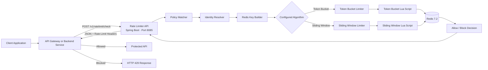
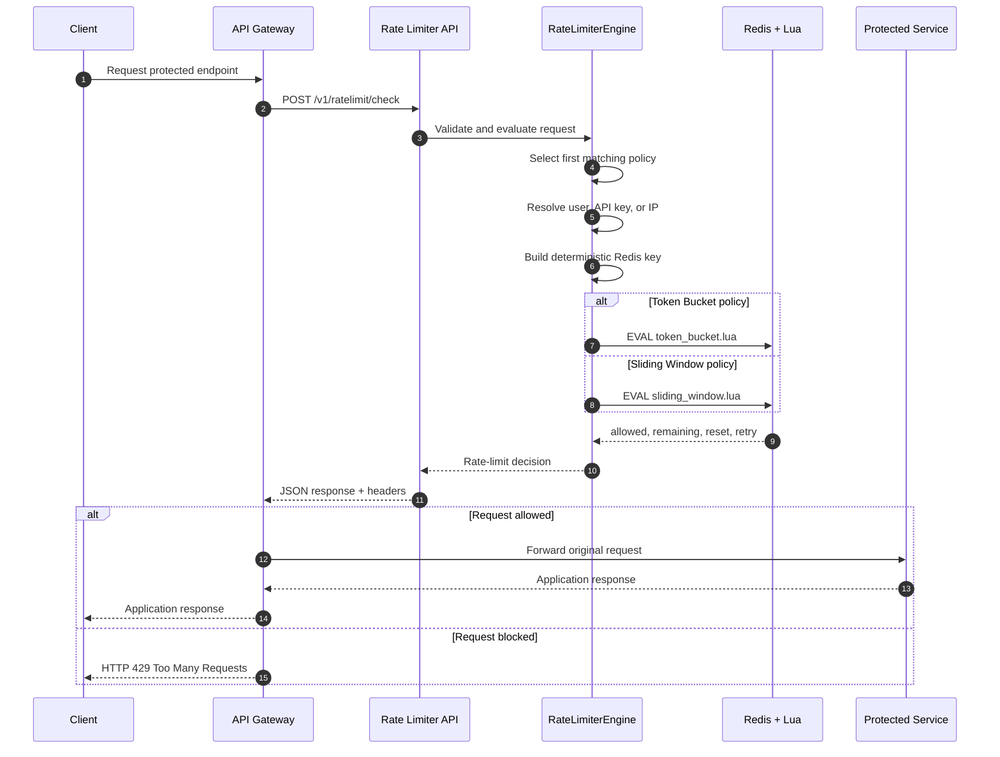
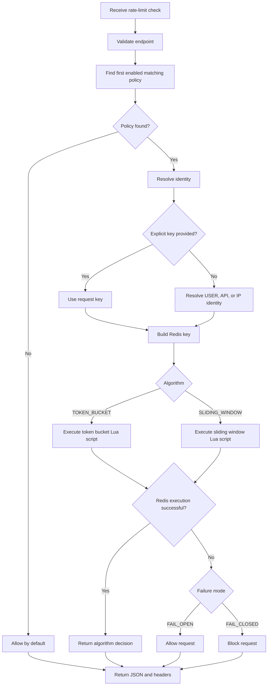
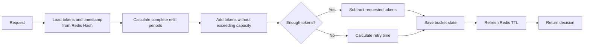
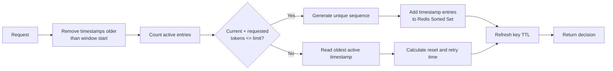
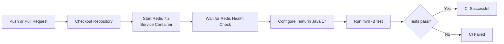

<div align="center">

# Distributed API Rate Limiter

### Redis-Backed Rate-Limit Decision Service with Atomic Lua Execution

A distributed API protection service built with Spring Boot, Redis, and Lua that evaluates configurable per-user, per-IP, per-API-key, and per-endpoint rate-limit policies.

[](https://github.com/leelamanisankarpeerukattla/distributed-api-rate-limiter/actions/workflows/ci.yml)
[](https://openjdk.org/projects/jdk/17/)
[](https://spring.io/projects/spring-boot)
[](https://redis.io/)
[](https://www.lua.org/)
[](https://www.docker.com/)
[](LICENSE)

**Java 17 · Spring Boot · Redis · Lua · Micrometer · Prometheus · Testcontainers · Docker · GitHub Actions**

</div>

---

## Table of Contents

* [Overview](#overview)
* [Key Capabilities](#key-capabilities)
* [System Architecture](#system-architecture)
* [Request Processing Flow](#request-processing-flow)
* [Rate-Limiting Algorithms](#rate-limiting-algorithms)
* [Policy Matching](#policy-matching)
* [Identity and Key Resolution](#identity-and-key-resolution)
* [Redis Data Model](#redis-data-model)
* [API Reference](#api-reference)
* [Rate-Limit Headers](#rate-limit-headers)
* [Failure Modes](#failure-modes)
* [Configuration](#configuration)
* [Observability](#observability)
* [Quick Start](#quick-start)
* [Testing](#testing)
* [Continuous Integration](#continuous-integration)
* [Project Structure](#project-structure)
* [Design Decisions](#design-decisions)
* [Production Integration](#production-integration)
* [Future Enhancements](#future-enhancements)
* [Contributing](#contributing)
* [License](#license)

---

## Overview

This project implements a standalone rate-limit decision service for protecting APIs from excessive traffic, abuse, accidental request floods, and unfair resource consumption.

Applications, API gateways, and backend services call the rate limiter before processing a protected operation. The service:

1. Matches the request to a configured policy.
2. Resolves the rate-limit identity.
3. Creates a deterministic Redis key.
4. Executes the selected rate-limiting algorithm atomically in Redis.
5. Returns an allow-or-block decision.
6. Includes quota, remaining capacity, reset time, and retry information.

The service supports two algorithms:

* **Token Bucket** for burst-friendly rate limiting
* **Sliding Window Log** for precise request counting

Redis acts as the shared state store, allowing multiple rate-limiter application instances to evaluate requests against the same counters.

---

## Key Capabilities

### Distributed enforcement

* Shared Redis state across application instances
* Deterministic keys for consistent limit enforcement
* Atomic decisions through Redis Lua scripts
* No application-local counters
* Stateless Spring Boot application instances

### Multiple algorithms

* Token Bucket
* Sliding Window Log
* Configurable algorithm per policy
* Weighted requests through token consumption

### Flexible policy scopes

* Per user
* Per API key
* Per IP address
* Per endpoint
* Wildcard endpoint matching
* Ordered first-match policy selection

### Availability controls

* Configurable fail-open behavior
* Configurable fail-closed behavior
* Explicit fallback decisions during Redis failures
* Automatic expiration of inactive Redis keys

### Operational visibility

* Spring Boot Actuator
* Prometheus metrics
* Health probes
* Per-policy decision counters
* Allowed and blocked outcome tags

### Developer experience

* YAML-based policy configuration
* Docker Compose startup
* Multi-stage Docker image
* Redis-backed integration tests
* Testcontainers
* GitHub Actions continuous integration

---

## System Architecture


```mermaid
flowchart LR
    Client["Client Application"] --> Gateway["API Gateway or Backend Service"]

    Gateway -->|"POST /v1/ratelimit/check"| API["Rate Limiter API<br/>Spring Boot · Port 8085"]

    API --> Matcher["Policy Matcher"]
    Matcher --> Resolver["Identity Resolver"]
    Resolver --> KeyBuilder["Redis Key Builder"]

    KeyBuilder --> Algorithm{"Configured Algorithm"}

    Algorithm -->|Token Bucket| TB["Token Bucket Limiter"]
    Algorithm -->|Sliding Window| SW["Sliding Window Limiter"]

    TB --> Lua1["Token Bucket Lua Script"]
    SW --> Lua2["Sliding Window Lua Script"]

    Lua1 --> Redis[("Redis 7.2")]
    Lua2 --> Redis

    Redis --> Decision["Allow / Block Decision"]
    Decision --> API
    API -->|"JSON + Rate-Limit Headers"| Gateway

    Gateway -->|Allowed| Protected["Protected API"]
    Gateway -->|Blocked| Rejected["HTTP 429 Response"]
```

The rate limiter makes decisions but does not proxy or execute the protected request itself. The calling gateway or service is responsible for enforcing the returned decision.

---

## Request Processing Flow


```mermaid
sequenceDiagram
    autonumber

    participant Client
    participant Gateway as API Gateway
    participant API as Rate Limiter API
    participant Engine as RateLimiterEngine
    participant Redis as Redis + Lua
    participant Service as Protected Service

    Client->>Gateway: Request protected endpoint
    Gateway->>API: POST /v1/ratelimit/check
    API->>Engine: Validate and evaluate request
    Engine->>Engine: Select first matching policy
    Engine->>Engine: Resolve user, API key, or IP
    Engine->>Engine: Build deterministic Redis key

    alt Token Bucket policy
        Engine->>Redis: EVAL token_bucket.lua
    else Sliding Window policy
        Engine->>Redis: EVAL sliding_window.lua
    end

    Redis-->>Engine: allowed, remaining, reset, retry
    Engine-->>API: Rate-limit decision
    API-->>Gateway: JSON response + headers

    alt Request allowed
        Gateway->>Service: Forward original request
        Service-->>Gateway: Application response
        Gateway-->>Client: Application response
    else Request blocked
        Gateway-->>Client: HTTP 429 Too Many Requests
    end
```

### Decision flow


```mermaid
flowchart TD
    A["Receive rate-limit check"] --> B["Validate endpoint"]
    B --> C["Find first enabled matching policy"]

    C --> D{"Policy found?"}

    D -->|No| E["Allow by default"]
    D -->|Yes| F["Resolve identity"]

    F --> G{"Explicit key provided?"}

    G -->|Yes| H["Use request key"]
    G -->|No| I["Resolve USER, API, or IP identity"]

    H --> J["Build Redis key"]
    I --> J

    J --> K{"Algorithm"}

    K -->|TOKEN_BUCKET| L["Execute token bucket Lua script"]
    K -->|SLIDING_WINDOW| M["Execute sliding window Lua script"]

    L --> N{"Redis execution successful?"}
    M --> N

    N -->|Yes| O["Return algorithm decision"]
    N -->|No| P{"Failure mode"}

    P -->|FAIL_OPEN| Q["Allow request"]
    P -->|FAIL_CLOSED| R["Block request"]

    E --> S["Return JSON and headers"]
    O --> S
    Q --> S
    R --> S
```

---

## Rate-Limiting Algorithms

## Token Bucket

Token Bucket permits controlled bursts while enforcing a sustained refill rate.

Each identity receives a bucket containing a configurable number of tokens. A request consumes one or more tokens. Tokens are replenished after complete refill periods have elapsed.

### Example policy

```yaml
algorithm: TOKEN_BUCKET
capacity: 20
refillTokens: 20
refillPeriodMs: 60000
```

This configuration means:

* The bucket can hold at most 20 tokens.
* A request can consume one or more tokens.
* Twenty tokens are restored for each completed 60-second refill period.
* Short bursts are allowed while long-term traffic remains controlled.

### Token Bucket flow


```mermaid
flowchart LR
    Request["Request"] --> Load["Load tokens and timestamp<br/>from Redis Hash"]

    Load --> Refill["Calculate complete refill periods"]
    Refill --> Cap["Add tokens without exceeding capacity"]

    Cap --> Enough{"Enough tokens?"}

    Enough -->|Yes| Consume["Subtract requested tokens"]
    Enough -->|No| Block["Calculate retry time"]

    Consume --> Save["Save bucket state"]
    Block --> Save

    Save --> Expire["Refresh Redis TTL"]
    Expire --> Result["Return decision"]
```

### Redis representation

The Token Bucket algorithm uses a Redis Hash:

```text
rl:token_bucket:<policy>:<identity>:<endpoint>
```

Stored fields:

```text
tokens
ts
```

The Lua script performs the complete read, refill, consume, update, and expiration operation atomically.

### Complexity

| Property             | Value                |
| -------------------- | -------------------- |
| Redis data structure | Hash                 |
| State per identity   | Constant             |
| Approximate space    | `O(1)`               |
| Script execution     | One Redis evaluation |
| Best suited for      | Burst-friendly APIs  |

---

## Sliding Window Log

Sliding Window Log records request timestamps inside the configured time window.

Before evaluating a request, the Lua script removes expired entries and counts the requests still inside the active window.

### Example policy

```yaml
algorithm: SLIDING_WINDOW
limit: 300
windowMs: 60000
```

This configuration permits up to 300 request tokens during any rolling 60-second window.

### Sliding Window flow


```mermaid
flowchart LR
    Request["Request"] --> Prune["Remove timestamps older<br/>than window start"]

    Prune --> Count["Count active entries"]
    Count --> Check{"Current + requested<br/>tokens <= limit?"}

    Check -->|Yes| Sequence["Generate unique sequence"]
    Sequence --> Add["Add timestamp entries<br/>to Redis Sorted Set"]

    Check -->|No| Oldest["Read oldest active timestamp"]
    Oldest --> Retry["Calculate reset and retry time"]

    Add --> Expire["Refresh key TTL"]
    Retry --> Expire

    Expire --> Result["Return decision"]
```

### Redis representation

The Sliding Window algorithm uses:

```text
Redis Sorted Set — active request timestamps
Redis String     — sequence number for unique members
```

Keys follow this structure:

```text
rl:sliding_window:<policy>:<identity>:<endpoint>
rl:sliding_window:<policy>:<identity>:<endpoint>:seq
```

Each consumed token creates an entry in the sorted set. Expired entries are removed before the current request is evaluated.

### Complexity

| Property             | Value                            |
| -------------------- | -------------------------------- |
| Redis data structure | Sorted Set and sequence key      |
| State per identity   | Proportional to active requests  |
| Approximate space    | `O(n)` within the window         |
| Precision            | Exact rolling-window enforcement |
| Best suited for      | Strict quotas and sensitive APIs |

---

## Algorithm Comparison

| Capability               | Token Bucket                    | Sliding Window Log                 |
| ------------------------ | ------------------------------- | ---------------------------------- |
| Allows controlled bursts | Yes                             | Limited by rolling-window count    |
| Precise rolling window   | No                              | Yes                                |
| Redis memory usage       | Constant per key                | One entry per active token         |
| Redis structure          | Hash                            | Sorted Set                         |
| Weighted requests        | Yes                             | Yes                                |
| Recommended use          | General APIs and bursty traffic | Strict security or quota endpoints |
| Operational cost         | Lower                           | Higher for large limits            |

---

## Policy Matching

Policies are loaded from:

```text
src/main/resources/application.yml
```

The engine evaluates policies in configuration order and selects the **first enabled matching policy**.

Policy order therefore matters.

Example:

```yaml
policies:
  - id: perUserOrders
    enabled: true
    match:
      endpoint: "POST:/orders"

  - id: perIpGlobal
    enabled: true
    match:
      endpoint: "*"
```

A request for `POST:/orders` matches `perUserOrders` first. The wildcard policy is not additionally applied because the current implementation selects one policy per decision.

### Endpoint format

Endpoints use:

```text
METHOD:/path
```

Examples:

```text
POST:/orders
GET:/products
POST:/auth/login
DELETE:/accounts/123
```

### Wildcard matching

The matcher supports simple `*` patterns.

```yaml
endpoint: "*"
```

Matches every endpoint.

```yaml
endpoint: "GET:/products/*"
```

Matches endpoints beginning with:

```text
GET:/products/
```

---

## Identity and Key Resolution

Every policy defines a `keyType`.

Supported values:

```text
USER
API
IP
```

### Resolution order

An explicit `key` in the request body takes priority over automatic key resolution.

When no explicit key is provided:

| Key type | Primary source     | Fallback                                           |
| -------- | ------------------ | -------------------------------------------------- |
| `USER`   | `X-User-Id` header | `anonymous`                                        |
| `API`    | `X-Api-Key` header | `unknown-api`                                      |
| `IP`     | Request body `ip`  | First `X-Forwarded-For` value, then remote address |

### User-based request

```bash
curl --request POST \
  --url http://localhost:8085/v1/ratelimit/check \
  --header "Content-Type: application/json" \
  --header "X-User-Id: 123" \
  --data '{
    "endpoint": "POST:/orders",
    "tokens": 1
  }'
```

### API-key-based request

```bash
curl --request POST \
  --url http://localhost:8085/v1/ratelimit/check \
  --header "Content-Type: application/json" \
  --header "X-Api-Key: client-application-a" \
  --data '{
    "endpoint": "GET:/reports",
    "tokens": 1
  }'
```

### IP-based request

```bash
curl --request POST \
  --url http://localhost:8085/v1/ratelimit/check \
  --header "Content-Type: application/json" \
  --header "X-Forwarded-For: 203.0.113.10" \
  --data '{
    "endpoint": "POST:/auth/login",
    "tokens": 1
  }'
```

---

## Redis Data Model

Redis keys are generated using:

```text
<prefix>:<algorithm>:<policy-id>:<identity>:<normalized-endpoint>
```

Example:

```text
rl:token_bucket:perUserOrders:user-123:POST__orders
```

Endpoint `/` and `:` characters are replaced with `_` when constructing Redis keys.

### Key lifecycle

Inactive keys automatically expire.

The application calculates a TTL using:

```text
max(algorithm period × 3, 60 seconds)
```

For Token Bucket, the algorithm period is the refill period.

For Sliding Window, the algorithm period is the configured window.

This prevents abandoned identities from remaining in Redis indefinitely.

---

## API Reference

Base URL:

```text
http://localhost:8085
```

## Evaluate a request

```http
POST /v1/ratelimit/check
```

### Request body

```json
{
  "key": "user:123",
  "endpoint": "POST:/orders",
  "tokens": 1,
  "ip": "203.0.113.10"
}
```

### Request fields

| Field      | Required | Default | Description                                              |
| ---------- | -------- | ------: | -------------------------------------------------------- |
| `endpoint` | Yes      |       — | Endpoint identifier in `METHOD:/path` format             |
| `key`      | No       | Derived | Explicit identity that overrides header or IP resolution |
| `tokens`   | No       |     `1` | Number of units consumed by the operation                |
| `ip`       | No       | Derived | Explicit client IP override for IP-based policies        |

Values below one for `tokens` are normalized to one by the rate-limiter engine.

### Allowed response

```json
{
  "allowed": true,
  "policyId": "perUserOrders",
  "key": "user:123",
  "endpoint": "POST:/orders",
  "limit": 20,
  "remaining": 19,
  "resetEpochMs": 1730000000000,
  "retryAfterMs": 0,
  "modeUsed": "FAIL_CLOSED"
}
```

### Blocked response

```json
{
  "allowed": false,
  "policyId": "perUserOrders",
  "key": "user:123",
  "endpoint": "POST:/orders",
  "limit": 20,
  "remaining": 0,
  "resetEpochMs": 1730000000000,
  "retryAfterMs": 1200,
  "modeUsed": "FAIL_CLOSED"
}
```

### Important response behavior

The decision endpoint returns a JSON decision using a successful API response even when:

```json
{
  "allowed": false
}
```

The calling API gateway or application should translate a blocked decision into:

```http
HTTP/1.1 429 Too Many Requests
```

This keeps the rate limiter independent from the protected application’s HTTP response lifecycle.

## View active policies

```http
GET /v1/ratelimit/policies
```

Example:

```bash
curl http://localhost:8085/v1/ratelimit/policies
```

The endpoint returns the policies currently loaded from application configuration.

---

## Rate-Limit Headers

Every check response includes:

| Header                  | Meaning                              | Unit                    |
| ----------------------- | ------------------------------------ | ----------------------- |
| `X-RateLimit-Limit`     | Maximum capacity or request limit    | Tokens or requests      |
| `X-RateLimit-Remaining` | Capacity remaining after evaluation  | Tokens or requests      |
| `X-RateLimit-Reset`     | Time when capacity becomes available | Unix epoch milliseconds |
| `Retry-After`           | Recommended waiting period           | Whole seconds           |

Example:

```text
X-RateLimit-Limit: 20
X-RateLimit-Remaining: 0
X-RateLimit-Reset: 1730000000000
Retry-After: 1
```

---

## Failure Modes

The service supports two behaviors when Redis is unavailable or Lua execution fails.

## Fail closed

```yaml
defaultMode: FAIL_CLOSED
```

The request is blocked when the rate limiter cannot verify available capacity.

Recommended for:

* Authentication endpoints
* Payment operations
* Security-sensitive APIs
* Expensive backend operations
* Abuse-prevention controls

Fallback behavior:

```json
{
  "allowed": false,
  "remaining": 0,
  "retryAfterMs": 1000,
  "modeUsed": "FAIL_CLOSED"
}
```

## Fail open

```yaml
defaultMode: FAIL_OPEN
```

The request is allowed when Redis is unavailable.

Recommended for:

* High-availability read APIs
* Non-critical limits
* Systems where availability is more important than strict quota enforcement

Fallback behavior:

```json
{
  "allowed": true,
  "retryAfterMs": 0,
  "modeUsed": "FAIL_OPEN"
}
```

### No matching policy

When no enabled policy matches the supplied endpoint, the service allows the request by default.

The response contains:

```json
{
  "allowed": true,
  "policyId": null,
  "limit": 0,
  "remaining": 0
}
```

---

## Configuration

Default application configuration:

```yaml
server:
  port: 8085

spring:
  application:
    name: distributed-api-rate-limiter
  data:
    redis:
      host: ${REDIS_HOST:localhost}
      port: ${REDIS_PORT:6379}

management:
  endpoints:
    web:
      exposure:
        include: health,info,prometheus,metrics
  endpoint:
    health:
      probes:
        enabled: true

ratelimiter:
  defaultMode: FAIL_CLOSED
  keyPrefix: rl

  policies:
    - id: perUserOrders
      enabled: true
      match:
        endpoint: "POST:/orders"
      keyType: USER
      algorithm: TOKEN_BUCKET
      capacity: 20
      refillTokens: 20
      refillPeriodMs: 60000

    - id: perIpGlobal
      enabled: true
      match:
        endpoint: "*"
      keyType: IP
      algorithm: SLIDING_WINDOW
      limit: 300
      windowMs: 60000
```

### Token Bucket policy fields

| Property         | Description                              |
| ---------------- | ---------------------------------------- |
| `id`             | Unique policy identifier                 |
| `enabled`        | Enables or disables the policy           |
| `match.endpoint` | Endpoint or wildcard pattern             |
| `keyType`        | `USER`, `API`, or `IP`                   |
| `algorithm`      | `TOKEN_BUCKET`                           |
| `capacity`       | Maximum bucket capacity                  |
| `refillTokens`   | Tokens added per completed refill period |
| `refillPeriodMs` | Refill period in milliseconds            |

### Sliding Window policy fields

| Property         | Description                                 |
| ---------------- | ------------------------------------------- |
| `id`             | Unique policy identifier                    |
| `enabled`        | Enables or disables the policy              |
| `match.endpoint` | Endpoint or wildcard pattern                |
| `keyType`        | `USER`, `API`, or `IP`                      |
| `algorithm`      | `SLIDING_WINDOW`                            |
| `limit`          | Maximum tokens allowed in the active window |
| `windowMs`       | Rolling-window size in milliseconds         |

### Example login-protection policy

Place specific policies before the wildcard policy:

```yaml
- id: loginPerIp
  enabled: true
  match:
    endpoint: "POST:/auth/login"
  keyType: IP
  algorithm: SLIDING_WINDOW
  limit: 5
  windowMs: 60000
```

### Example expensive-operation policy

```yaml
- id: reportGeneration
  enabled: true
  match:
    endpoint: "POST:/reports/generate"
  keyType: USER
  algorithm: TOKEN_BUCKET
  capacity: 5
  refillTokens: 1
  refillPeriodMs: 30000
```

The caller can consume multiple tokens for more expensive requests:

```json
{
  "endpoint": "POST:/reports/generate",
  "tokens": 3
}
```

---

## Observability

The application uses Spring Boot Actuator, Micrometer, and the Prometheus registry.

### Health

```http
GET /actuator/health
```

```bash
curl http://localhost:8085/actuator/health
```

### Prometheus metrics

```http
GET /actuator/prometheus
```

```bash
curl http://localhost:8085/actuator/prometheus
```

### Actuator metrics

```http
GET /actuator/metrics
```

### Decision metric

The service records:

```text
ratelimiter_decisions_total
```

Metric tags:

| Tag         | Example                |
| ----------- | ---------------------- |
| `policy`    | `perUserOrders`        |
| `algorithm` | `TOKEN_BUCKET`         |
| `outcome`   | `allowed` or `blocked` |

Example Prometheus series:

```text
ratelimiter_decisions_total{
  policy="perUserOrders",
  algorithm="TOKEN_BUCKET",
  outcome="allowed"
}
```

This metric can support dashboards for:

* Allowed request volume
* Blocked request volume
* Most frequently triggered policies
* Algorithm usage
* Sudden traffic or abuse patterns

---

## Quick Start

### Prerequisites

Install:

* Docker Desktop
* Git

### Clone the repository

```bash
git clone https://github.com/leelamanisankarpeerukattla/distributed-api-rate-limiter.git

cd distributed-api-rate-limiter
```

### Start with Docker Compose

```bash
docker compose up --build
```

Docker Compose starts:

| Component        | Port |
| ---------------- | ---: |
| Rate Limiter API | 8085 |
| Redis            | 6379 |

Service URL:

```text
http://localhost:8085
```

### Verify health

```bash
curl http://localhost:8085/actuator/health
```

### Evaluate an order request

```bash
curl --request POST \
  --url http://localhost:8085/v1/ratelimit/check \
  --header "Content-Type: application/json" \
  --header "X-User-Id: 123" \
  --data '{
    "endpoint": "POST:/orders",
    "tokens": 1
  }'
```

### Demonstrate blocking

The default `perUserOrders` policy contains 20 tokens.

```bash
for i in {1..21}; do
  curl --silent \
    --request POST \
    --url http://localhost:8085/v1/ratelimit/check \
    --header "Content-Type: application/json" \
    --data '{
      "key": "demo-user",
      "endpoint": "POST:/orders",
      "tokens": 1
    }'

  echo
done
```

The first 20 checks should be allowed. The next check should return:

```json
{
  "allowed": false,
  "remaining": 0
}
```

### Stop the application

```bash
docker compose down
```

### Remove containers and local data

```bash
docker compose down --volumes
```

---

## Run Without Docker Compose

### Prerequisites

* Java 17
* Maven 3.9+
* Redis 7+

Start Redis locally:

```bash
docker run --name rate-limiter-redis \
  --rm \
  --publish 6379:6379 \
  redis:7.2-alpine
```

Run the application:

```bash
mvn spring-boot:run
```

Alternatively, build and run the JAR:

```bash
mvn clean package

java -jar target/distributed-api-rate-limiter-1.0.0.jar
```

Redis connection settings can be changed through:

```text
REDIS_HOST
REDIS_PORT
```

Example:

```bash
REDIS_HOST=localhost \
REDIS_PORT=6379 \
java -jar target/distributed-api-rate-limiter-1.0.0.jar
```

---

## Testing

Run the complete test suite:

```bash
mvn test
```

The repository includes a Spring Boot integration test using Testcontainers.

The integration test:

1. Starts Redis 7.2 in a container.
2. Starts the rate-limiter application on a random port.
3. Uses the `perUserOrders` Token Bucket policy.
4. Sends 20 requests for the same key.
5. Verifies that all 20 are allowed.
6. Sends a 21st request.
7. Verifies that the request is blocked with zero remaining capacity.

Testcontainers gives the test an isolated Redis instance and avoids dependence on a manually installed local Redis server.

---

## Continuous Integration

GitHub Actions runs for:

* Pushes to `main`
* Pull requests targeting `main`

### CI pipeline


```mermaid
flowchart LR
    Trigger["Push or Pull Request"] --> Checkout["Checkout Repository"]

    Checkout --> Redis["Start Redis 7.2<br/>Service Container"]
    Redis --> Health["Wait for Redis Health Check"]

    Health --> Java["Configure Temurin Java 17"]
    Java --> Test["Run mvn -B test"]

    Test --> Result{"Tests pass?"}

    Result -->|Yes| Success["CI Successful"]
    Result -->|No| Failure["CI Failed"]
```

The workflow supplies:

```text
REDIS_HOST=localhost
REDIS_PORT=6379
```

The CI Redis service uses:

```text
redis:7.2-alpine
```

---

## Project Structure

```text
distributed-api-rate-limiter/
├── .github/
│   └── workflows/
│       └── ci.yml
│
├── src/
│   ├── main/
│   │   ├── java/com/example/ratelimiter/
│   │   │   ├── api/
│   │   │   │   ├── RateLimiterController.java
│   │   │   │   ├── RateLimitCheckRequest.java
│   │   │   │   └── RateLimitDecisionResponse.java
│   │   │   │
│   │   │   ├── config/
│   │   │   │   ├── Algorithm.java
│   │   │   │   ├── FailureMode.java
│   │   │   │   ├── KeyType.java
│   │   │   │   ├── PolicyMatch.java
│   │   │   │   ├── RateLimitPolicy.java
│   │   │   │   └── RateLimiterProperties.java
│   │   │   │
│   │   │   ├── core/
│   │   │   │   ├── RateLimiter.java
│   │   │   │   ├── RateLimitDecision.java
│   │   │   │   ├── RateLimiterEngine.java
│   │   │   │   ├── TokenBucketRedisRateLimiter.java
│   │   │   │   └── SlidingWindowRedisRateLimiter.java
│   │   │   │
│   │   │   ├── redis/
│   │   │   │   └── Redis configuration
│   │   │   │
│   │   │   └── RateLimiterApplication.java
│   │   │
│   │   └── resources/
│   │       ├── application.yml
│   │       └── lua/
│   │           ├── token_bucket.lua
│   │           └── sliding_window.lua
│   │
│   └── test/
│       └── java/com/example/ratelimiter/
│           └── RateLimiterIntegrationTest.java
│
├── Dockerfile
├── docker-compose.yml
├── pom.xml
├── README.md
├── CONTRIBUTING.md
├── SECURITY.md
├── CODE_OF_CONDUCT.md
└── LICENSE
```

---

## Design Decisions

### Redis as shared state

Application-local counters would produce inconsistent results when requests are distributed across several service instances.

Redis provides a shared state store so every instance evaluates the same quota.

### Atomic Lua scripts

A rate-limit decision requires multiple operations:

* Read current state
* Remove or calculate expired capacity
* Determine whether the request is allowed
* Consume capacity
* Update state
* Refresh expiration
* Calculate reset and retry information

Performing these as separate Redis commands could create race conditions under concurrent traffic.

Lua packages the entire operation into one atomic Redis execution.

### Strategy-based algorithms

Both implementations satisfy the same `RateLimiter` interface:

```java
RateLimitDecision evaluate(
    String redisKey,
    RateLimitPolicy policy,
    long tokens,
    long nowEpochMs
);
```

This keeps algorithm selection inside the engine and makes future algorithms easier to add.

### Configuration-driven policies

Policies are stored in YAML instead of being hardcoded inside controllers.

This separates:

* API handling
* Policy definition
* Identity resolution
* Algorithm execution
* Redis state management

### Weighted operations

Not every API operation has the same cost.

The `tokens` field allows a caller to assign more quota consumption to expensive operations.

Example:

```text
Normal read       = 1 token
Search request    = 2 tokens
Report generation = 5 tokens
```

### First-match policy selection

The first enabled policy whose endpoint pattern matches the request is selected.

This behavior is simple and deterministic, but specific policies must appear before broad wildcard policies.

### Automatic key expiration

Redis state is temporary and receives an expiration time.

Inactive identities are removed automatically, limiting long-term memory growth.

---

## Production Integration

The intended integration point is an API gateway, reverse proxy, service mesh component, or application middleware.

### Example gateway logic

```text
1. Receive the original API request.
2. Construct METHOD:/path.
3. Identify the authenticated user, API key, or client IP.
4. Call POST /v1/ratelimit/check.
5. Inspect the allowed field.
6. Forward the request when allowed=true.
7. Return HTTP 429 when allowed=false.
8. Copy rate-limit headers to the client response.
```

### Trust-boundary considerations

The service currently accepts identity information through:

* Request body `key`
* Request body `ip`
* `X-User-Id`
* `X-Api-Key`
* `X-Forwarded-For`

In production, the rate limiter should be reachable only by trusted internal gateways or services.

A secure deployment should:

* Prevent direct public access
* Strip client-supplied internal identity headers
* Set identity headers only after authentication
* Trust `X-Forwarded-For` only from approved proxies
* Authenticate service-to-service calls
* Apply TLS
* Use network policies or private subnets
* Protect the policy-list endpoint when required
* Validate or sanitize externally provided keys
* Configure Redis authentication and encryption
* Use Redis high availability or a managed Redis service

---

## Future Enhancements

### Policy capabilities

* Apply multiple policies to one request
* Combine user and global IP limits
* Per-policy failure modes
* Policy priorities
* Runtime policy updates
* Database-backed policy storage
* Administrative policy API
* Policy validation at application startup

### Algorithms

* Fixed Window Counter
* Sliding Window Counter
* Leaky Bucket
* Concurrency limiting
* Adaptive rate limiting
* Distributed semaphore support

### Reliability

* Redis Cluster support
* Redis Sentinel support
* Script SHA caching with `EVALSHA`
* Timeouts and connection-pool tuning
* Circuit breaker integration
* Graceful degradation controls
* Load and latency benchmarks

### Security

* Service-to-service authentication
* Request signing
* API-key hashing
* Input-length validation
* Trusted proxy configuration
* Administrative endpoint authorization
* Audit logging

### Observability

* Request latency histogram
* Redis execution timer
* Failure-mode activation counter
* Policy miss counter
* Prometheus alert rules
* Grafana dashboard
* OpenTelemetry traces
* Structured JSON logging

### Testing

* Sliding Window integration tests
* Fail-open tests
* Fail-closed tests
* Wildcard policy tests
* Concurrent request tests
* Redis outage tests
* Performance and stress tests
* Container image tests

### Deployment

* Kubernetes manifests
* Helm chart
* Readiness and liveness probes
* Horizontal Pod Autoscaling
* Resource requests and limits
* Container vulnerability scanning
* Versioned image publishing
* Staging and production workflows

---

## Contributing

Contributions, bug reports, and design suggestions are welcome.

Before contributing, review:

* [Contributing Guide](CONTRIBUTING.md)
* [Code of Conduct](CODE_OF_CONDUCT.md)
* [Security Policy](SECURITY.md)

### Contribution workflow

```bash
git checkout -b feature/your-feature

git add .

git commit -m "Add your feature"

git push origin feature/your-feature
```

Then open a pull request describing:

* The problem being solved
* The proposed implementation
* Testing performed
* Configuration or compatibility changes

---

## License

This project is licensed under the [MIT License](LICENSE).

---

## Author

**Leela Mani Sankar Peerukattla**

[GitHub Profile](https://github.com/leelamanisankarpeerukattla)

---

<div align="center">

Built to demonstrate distributed systems, atomic Redis operations, API protection, configurable policies, observability, integration testing, and containerized backend engineering.

</div>
